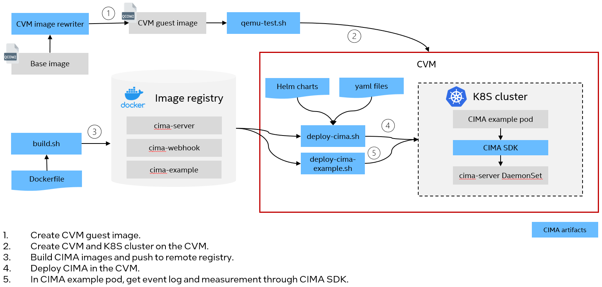
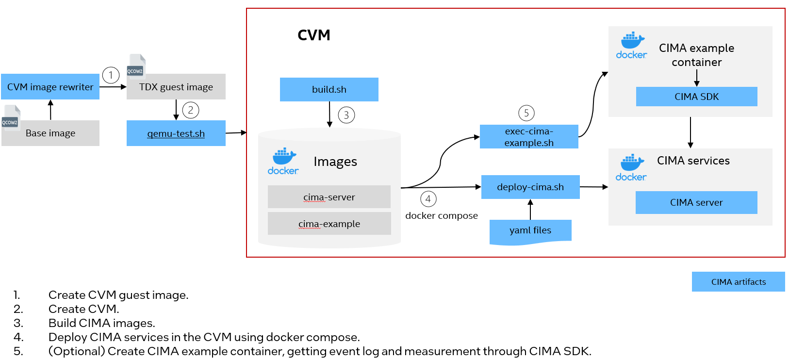

# CIMA Deployment Guide

CIMA is designed for collecting confidential computing primitives in cloud native environments. It can run as DaemonSet in a Kubernetes cluster or containers in a Docker environment on confidential virtual machines, such as Intel TDX guest(TD). 

CIMA deployment supports to deploy on Ubuntu 24.04 and Ubuntu 23.10. The follows will use Ubuntu 24.04. Please see [deployment guide](https://github.com/cc-api/container-integrity-measurement-agent/blob/v0.4.0/deployment/README.md) for Ubuntu 23.10.

## Build CIMA Kernel

Run [build.sh](../tools/build/build.sh) to build kernel packages for CIMA. It's recommended to run the tool on TDX host mentioned in [Configuration](../README.md#configuration).

It will generate a `output` folder including kernel packages. The folder will be used in the next step.
```
$ cd tools/build
$ sudo ./build.sh
```

**NOTE:**
  - CIMA kernel patches are at [kernel](../tools/build/kernel/)
  - The tool should be run on a Ubuntu 24.04 TDX host with TDX early preview packages installed. Please refer to [here](https://github.com/canonical/tdx)


## Prepare TDX guest image

Run [cvm image rewriter](https://github.com/cc-api/cvm-image-rewriter) to prepare a TDX guest image for CIMA deployment. The default user name is `tdx`. The password is `123456`.

It's recommended to run the tool on TDX host mentioned in [Configuration](../README.md#configuration).

A quick start is as below.

```
# Refer to TDX early preview to [create a TD guest image](https://github.com/canonical/tdx?tab=readme-ov-file#create-a-new-td-guest-image).

# Get cvm image rewriter. 
$ git clone https://github.com/cc-api/cvm-image-rewriter.git

# Plugin 98 is an example of setting IMA. It will take a few minutes. Suggest to skip it if not needed.
$ touch cvm-image-rewriter/plugins/98-ima-example/NOT_RUN

# Set file path of the generated output folder above. Plugin 06 will install the kernel in the guest image.
$ export CVM_TDX_GUEST_REPO=<path to above output folder>

# (Optional)Set image size
$ export GUEST_SIZE=<image size>G

# Run CVM image rewriter to configure a TDX guest image for CIMA
$ cd cvm-image-rewriter
$ ./run.sh -i <initial guest image>  -t <timeout in minutes, suggest to set to 15>
```

**NOTE:**
 - By default all the plugins will be executed. Generate a `NOT_RUN` file under the specific plugin folder if you want to skip it.
 - Plugin 98 is an example of setting IMA. It will take a few minutes. Suggest to skip it if not needed.
 - It's required to run [plugin](https://github.com/cc-api/cvm-image-rewriter/tree/main/plugins) 06, 07, 08, 09, 10 for CIMA.


## Create a TD

Start a TD using [qemu-test.sh](../tools/cvm-image-rewriter/qemu-test.sh).

 - Use `qemu-test.sh`.
    ```
    $ sudo ./qemu-test.sh -i output.qcow2
    ```

Check the kernel version. It should be CIMA kernel as below.

```
$ uname -ar | grep -i cima
Linux tdx-guest 6.5.0-1003-intel-opt #3.cima.1
```

If above output is empty, refer to [Build CIMA Kernel](#build-cima-kernel) to generate CIMA kernel packages. Then install the packages in the TD and make it as default kernel.

## Build CIMA images

Run script [build.sh](../container/build.sh) to generate CIMA images. It will generate 3 images and push them to user specific registry. Learn more details in the [README.md](../container/README.md).

**NOTE:**
  - The scripts need to run on a server with docker installed.
  - Run `docker login` before running the tool to make sure it can pull images.
  - Set proxy server in your environment if needed. See more details in [Configure Docker to use a proxy server](https://docs.docker.com/network/proxy/).

```
$ cd container
$ sudo ./build.sh -r <remote registry> -g <docker image tag>

e.g.

# Build images with tag 0.5 and push them to remote registry test-registry.intel.com
$ sudo ./build.sh -r test-registry.intel.com/test -g 0.5

# Build images only with tag 0.5
$ sudo ./build.sh -a build -g 0.5
```

After the script is executed successfully, it's supposed to see below docker images for CIMA.

```
$ sudo docker images
cima-example                    <your image tag>
cima-server                     <your image tag>
cima-webhook                    <your image tag>
```

## Setup QGS and PCCS on the Host

Intel Quote Generation Service(QGS) and Provisioning Certification Caching Service(PCCS) should be installed and configured on the host for getting TD Quote. Please refer to [PCCS](https://github.com/cc-api/container-integrity-measurement-agent/blob/v0.5.0/container/pccs/README.md) and [QGS](https://github.com/cc-api/container-integrity-measurement-agent/blob/v0.5.0/container/qgs/README.md) tp start PCCS and QGS container and register the platform.


## Deploy CIMA in Kubernetes

Below diagram illustrates CIMA deployment process in a Kubernetes cluster. If you want to install CIMA services as DamonSets in the Kubernetes cluster, please refer to [CIMA deployment in Kubernetes](./kubernetes/README.md).




## Deploy CIMA in Docker

Below diagram illustrates CIMA deployment process using docker compose. If you want to setup CIMA services as docker containers, please refer to [CIMA deployment in Docker](./docker-compose/README.md).


