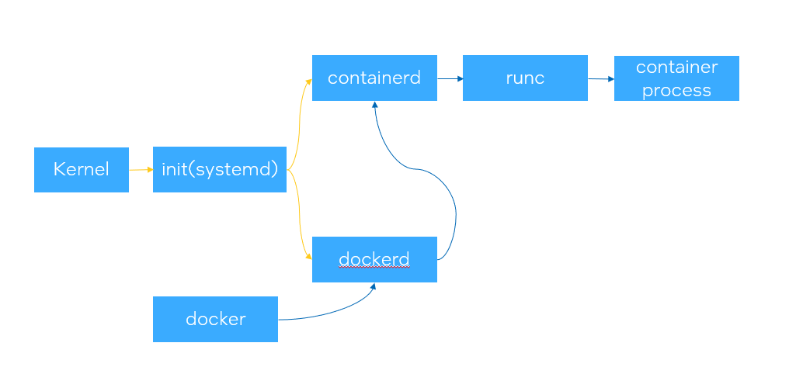
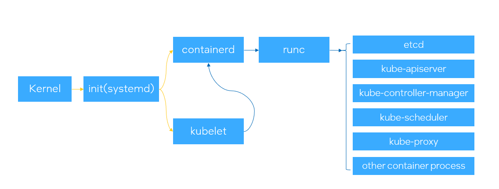
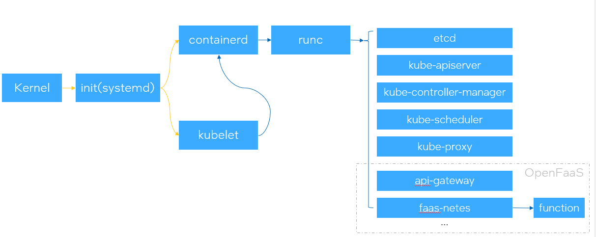
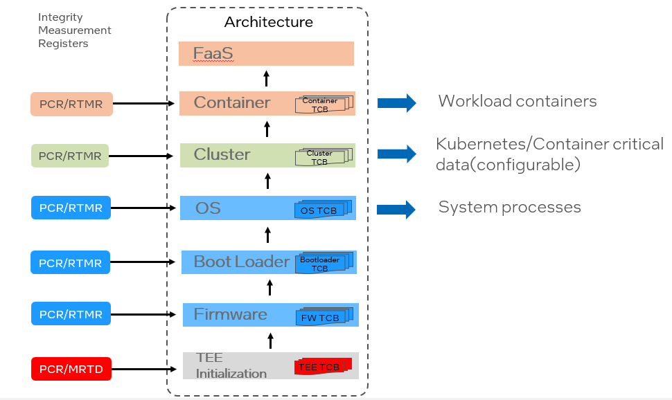
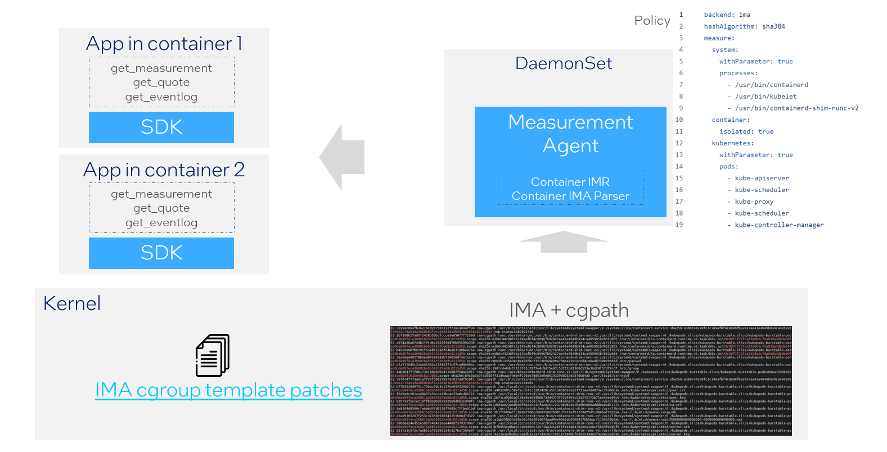
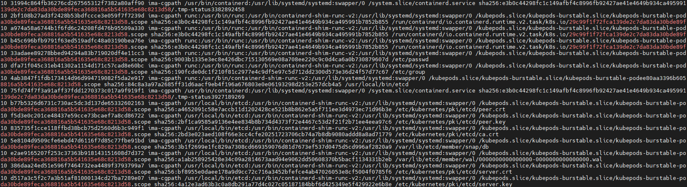

# Container Measurement Design Guide

A [container](https://www.docker.com/resources/what-container/) is a standard unit of software that packages up code and all its dependencies so the application runs quickly and reliably from one computing environment to another. In cloud native environment, containers decouple applications from the underlying host infrastructure. This makes deployment easier in different cloud or OS environments.

## Integrity Measurement

In Trusted Computing Group (TCG) [Trusted Platform Module (TPM) architecture](https://trustedcomputinggroup.org/wp-content/uploads/TCG_TPM2_r1p59_Part1_Architecture_pub.pdf) specification, an integrity measurement is a value that represents a possible change in the trust state of the platform. The measured object may be anything of meaning but is often
* a data value
* the hash of code or data, or
* an indication of the signer of some code or data.

For integrity measurement collection, TCG defined [Event Log specification](https://trustedcomputinggroup.org/wp-content/uploads/TCG-Guidance-Integrity-Measurements-Event-Log-Processing_v1_r0p118_24feb2022-1.pdf), an Event is a kind of executable, data, or action that may affect the device’s trust state, and integrity measurement is A deterministic (1:1) representation of an Event. Some Events may be large blocks of executable code and other Events may be small strings such as a version number, configuration data, etc. TCG uses a digest size of a hash to hold an integrity measurement.

The transitive trust chain is maintained by measurement of the code. A power-on reset creates an environment in which the platform is in a known initial state, with the main CPU running code from some well-defined initial location. Since that code has exclusive control of the platform at that time, it may make measurements of the platform from boot firmware. From these initial measurements, a chain of trust may be established. This chain of trust is created on platform reset, does not allow any change in trust state, and is thus called a static runtime measurement (SRTM).

## Chain of Trust for Container

The Trusted Execution Environment (TEE) serves as the foundation chain of trust during boot time, for instance, in [TDX Virtual Firmware (TDVF) design guide](https://cdrdv2-public.intel.com/733585/tdx-virtual-firmware-design-guide-rev-004-20231206.pdf), provides a single Trust Domain (TD) Measurement Register (MRTD) and four Runtime Measurement Registers (RTMR). There certainly are fewer TD measurement registers than TPM Platform Configuration Registers (PCRs). They are typically mapped as below:

| PCR Index | Typical Usage | TD Register |
| --- | --- | --- |
| 0 | FirmwareCode (BFV,including init page table) | MRTD |
| 1 | FirmwareData(CFV, TD Hob, ACPI Table) | RTMR[0] |
| 2 | Option ROM code | RTMR[1] |
| 3 | Option ROM code | RTMR[1] |
| 4 | OS loader code | RTMR[1] |
| 5 | Configuration(GPT, Boot Variable) | RTMR[1] |
| 6 | N/A | N/A |
| 7 | Secure Boot Configuration | RTMR[0] |
| 8~15 | TD OS measurement | RTMR[2] |

*RTMR[3] is reserved for special usage, such as virtual TPM. Users have the flexibility to utilize RTMR[3] if it is not required for these specialized purposes.*

During boot time, the TDVF, along with Grub and Shim, is responsible for managing the firmware, OS loader, and configuration measurements. As the system boots into the OS kernel, the responsibility for measuring processes and configurations shifts to the system itself.

In the context of container measurement chains, several typical use cases arise:

* Container services on a single node (virtual machine or bare metal)
* Container services in a cluster
* Function as a service (FaaS) in a cluster

### Container services on a single node

A typical measurement chain in a Linux OS involves the OS kernel initiating an `init` process, which in turn launches container services responsible for managing the containers.



### Container services in a cluster


In a cluster environment on a Linux OS, such as with Kubernetes, the measurement chain extends beyond container services. After initializing container services, Kubernetes proceeds to launch additional management containers, including but not limited to the API server, scheduler, and controller manager.



### FaaS in a cluster

In a cloud-native environment, Function as a Service (FaaS) is a typical usage, often based on a cluster infrastructure like Kubernetes integrated with platforms like OpenFaaS. A typical measurement chain in this setup involves:



## Critical Data in Container Measurement

From these typical usages, it is evident that for container measurement after booting up to the OS kernel, the critical data includes:

* System Processes/Services
  * init(systemd)
  * containerd/cri-o/...
  * runc/containerd-shim-runc/crun/...
* Kubernetes Pods/Containers/DaemonSet
  * etcd/kube-apiserver
  * kube-controller-manager/kube-scheduler
  * kubeproxy/...
  * measurement daemonset(CCNP)
* Versions/Configurations/Parameters/Status

## Container Measurement Architecture

For measurement purposes, Linux offers an [Integrity Measurement Architecture](https://sourceforge.net/p/linux-ima/wiki/Home/), a subsystem designed to:

* Detect any alterations made to files, whether accidental or malicious, both remotely and locally.
* Appraise a file's measurement against a pre-defined "good" value stored as an extended attribute.
* Enforce local file integrity to ensure the security and reliability of the system.

Based on the critical data and measurement chain described, the overall architecture can be outlined as follows:



* Boot Time Measurement:
  * During boot time, the Trusted Execution Environment (TEE), utilizing Intel Trust Domain Extensions (TDX) or similar technologies, establishes a chain of trust.
  * Components like TDVF, Grub, and Shim handle firmware, OS loader, and configuration measurements.
* OS Kernel Initialization:
  * The OS kernel initiates an "init" process, which in turn launches container services for managing containers.
* Cluster Management (e.g., Kubernetes):
  * Beyond container services, cluster management platforms like Kubernetes start additional management containers such as the API server, scheduler, and controller manager.
* FaaS in Cloud-Native Environment (e.g., OpenFaaS):
  * In a cloud-native setup, Function as a Service (FaaS) relies on a cluster infrastructure like Kubernetes integrated with platforms like OpenFaaS.
* Integrity Measurement:
  * Linux provides the Integrity Measurement Architecture, serving as a subsystem to detect file alterations, appraise file measurements against predefined values, and enforce local file integrity.

This architecture ensures a comprehensive approach to measurement and integrity across boot time, container management, cluster orchestration, and file integrity in Linux-based systems.

In a cloud-native environment leveraging the Integrity Measurement Architecture (IMA), a typical design might encompass the following elements:

* Bootstrapping and Initialization:
  * During bootstrapping, the system initializes the Integrity Measurement Architecture (IMA) subsystem.
The boot process includes verifying the integrity of critical components using IMA measurements.
* Container Security:
  * Containers are launched with IMA support enabled.
  * The IMA subsystem continuously monitors the integrity of container images, ensuring they haven't been tampered with or altered maliciously.
* Kubernetes Integration:
  * Kubernetes is configured to interact with IMA, utilizing its measurements for verifying container images and runtime integrity.
  * IMA measurements can be used as part of admission control mechanisms in Kubernetes to ensure only trusted containers are deployed.
* Policy Enforcement:
  * Policies are defined to specify which files or processes should be measured by IMA and how the measurements should be treated.
  * Enforcement mechanisms ensure that any unauthorized changes trigger alerts or are blocked, maintaining system integrity.
* Logging and Auditing:
  * IMA logs integrity measurement data for auditing and forensic purposes.
  * Integration with centralized logging and monitoring systems ensures comprehensive visibility into the integrity of the cloud-native environment.
* Continuous Monitoring and Response:
  * Continuous monitoring of IMA measurements allows for real-time detection of integrity violations.
  * Automated response mechanisms can be triggered in response to detected anomalies, such as quarantining compromised containers or rolling back unauthorized changes.
This design leverages IMA as a foundational component for ensuring the integrity and security of cloud-native environments, integrating with container orchestration platforms like Kubernetes to provide robust protection against unauthorized access and tampering.

Here's a proposal for an architecture designed to measure containers within a cloud-native environment:


*\*[IMA cgroup template patches](https://patchwork.kernel.org/project/linux-integrity/patch/20221224160912.17830-1-enrico.bravi@polito.it/)*

An example of an `etcd` pod measurement:

In this design, the Linux kernel's Integrity Measurement Architecture (IMA) assumes responsibility for collecting all runtime measurements and extending them to measurement registers, such as PCR or RTMR. A measurement agent deployed as a DaemonSet within the Kubernetes cluster retrieves all IMA measurements and expands them to cover system processes and cluster configurations.

The measurement agent also exposes an interface accessible to containers and applications within them. Applications within containers can invoke the DaemonSet to obtain system and cluster measurements. Additionally, a flexible configuration mechanism allows policies to be defined, specifying which measurements are collected and how they are used for integrity assessment and enforcement.

## Container Measurement Policy

The operating environment of a system is complex and constantly changing. Defining a policy can make measurements more flexible. Here is an example:

```YAML
backend: ima
hashAlgorithm: sha384
measure:
  system:
    withParameter: true
    processes:
      - /usr/bin/containerd
      - /usr/bin/kubelet
      - /usr/bin/containerd-shim-runc-v2
  container:
    isolated: true
  kubernetes:
    withParameter: true
    pods:
      - kube-apiserver
      - kube-scheduler
      - kube-proxy
      - kube-scheduler
      - kube-controller-manager
```

In this design, the backend for collecting runtime measurements can initially be the Integrity Measurement Architecture (IMA), with provisions for future expansion to other mechanisms. The choice of hash algorithm aligns with the runtime measurement register used, ensuring compatibility and consistency.

Within the measurement list, system processes can be explicitly defined and measured along with their parameters, allowing for granular integrity assessment.

The concept of container isolation determines whether a container can access the measurements of other containers. In a Kubernetes cluster environment, management pods or containers can also be defined for measurement purposes, ensuring comprehensive coverage of the cluster's integrity.

## Reference

[1] https://www.docker.com/resources/what-container/

[2] https://kubernetes.io/docs/concepts/containers/

[3] [TCG TPM architecture](https://trustedcomputinggroup.org/wp-content/uploads/TCG_TPM2_r1p59_Part1_Architecture_pub.pdf)

[4] [TCG Guidance on Integrity Measurements and Event Log
Processing](https://trustedcomputinggroup.org/wp-content/uploads/TCG-Guidance-Integrity-Measurements-Event-Log-Processing_v1_r0p118_24feb2022-1.pdf)

[5] [TDX Virtual Firmware design guide](https://cdrdv2-public.intel.com/733585/tdx-virtual-firmware-design-guide-rev-004-20231206.pdf)

[6] [Integrity Measurement Architecture](https://sourceforge.net/p/linux-ima/wiki/Home/)
